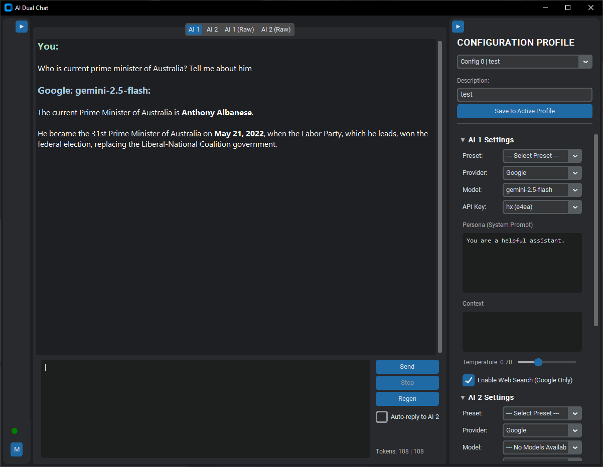

# AI Dual Chat

A Python-based desktop application for interacting with local and cloud-based Large Language Models. It supports Google's Gemini family through their API and local models served via Ollama. The tool provides a dual-chat environment where users can manage two concurrent AI instances, configure their behaviors, and facilitate an auto-reply interaction between them.



## Core Features

- **Multi-Provider Support**: Seamlessly switch between Google's Gemini models and local models served by Ollama.
- **Model & Key Management**: A dedicated Model Manager to add/remove multiple Google API keys, manage Ollama settings, and view model availability and status in real-time.
- **Configuration Presets**: Create, save, and apply model configuration presets (provider, model, API key) for quick setup.
- **Dual Chat Interface**: Interact with two AI models simultaneously in a clean, tabbed interface.
- **Rich Configuration**: Independently configure each AI's provider, model, persona (system prompt), and generation parameters (temperature, etc.).
- **API Key Failover**: For Google Gemini, if an API call fails due to a quota error, the application automatically switches to the next available valid key and retries the request.
- **Web Search Integration**: (Google-only) The AI can perform real-time web searches using DuckDuckGo to answer questions about recent events or provide up-to-date information.
- **Auto-Reply Functionality**: Enable one AI to automatically reply to the other, allowing for continuous, configurable conversations.
- **Session Management**: Save and load the complete state of an agent (model, system prompt, history) to a JSON file.
- **Multi-Language Support**: Switch the entire UI between English and Mandarin on the fly.

## Other Features

- **Raw Text View**: A "Raw" tab displays the conversation without markdown formatting for clarity.
- **Real-time Token Counts**: Monitor token usage for each turn and the total session.
- **UI Conveniences**: Collapsible sidebars, configurable fonts and colors, and a responsive layout.
- **Robust Error Handling**: Clear feedback on API errors, connection issues, and configuration problems.
- **Separated Conversation Logging**: All interactions are automatically saved to session-specific log files.

## Setup and Installation

1.  **Clone the repository**:
    ```bash
    git clone git clone https://github.com/hippohippo-ai/AIDualChat
    cd AIDualChat
    ```

2.  **Install dependencies**:
    Using a virtual environment is highly recommended.
    ```bash
    # Create and activate the virtual environment
    python -m venv venv
    venv\Scripts\activate  # On Windows
    # source venv/bin/activate  # On macOS/Linux

    # Install dependencies
    pip install -r requirements.txt
    ```

3.  **Configure Models**:
    - Run the application (`python main.py`).
    - Click the **Model Manager** button.
    - **For Google Gemini**:
        - Go to [Google AI Studio](https://aistudio.google.com/) to get your API key(s).
        - In the Model Manager, go to the "Google" tab, paste your key, add an optional note, and click "Add Key". You can add multiple keys.
    - **For Ollama**:
        - Ensure Ollama is running.
        - In the Model Manager, go to the "Ollama" tab and verify the host address is correct. Click "Save & Refresh" to connect and see your available models.

## Usage

1.  **Run the application**:
    ```bash
    python main.py
    ```

2.  **Configure an AI**:
    - In the right sidebar, select a **Provider** (Google or Ollama) for "AI 1" or "AI 2".
    - The **Model** and **API Key** (if applicable) dropdowns will update.
    - Alternatively, create and select a **Preset** for quick setup.
    - Customize the **Persona** (system prompt) and other settings.

3.  **Chat**:
    - Type a message in an AI's input box and click "Send" or press `Ctrl+Enter`.
    - To have one AI automatically respond to the other, check the "Auto-reply" box.

## Known Issues

- **Text Selection**: Due to limitations of the underlying UI component, selecting and copying text directly from the chat display may not work reliably. Use the "Raw" tab for easy copy-pasting.

## Contributing

Feel free to fork the repository, make improvements, and submit pull requests.

## License

This project is licensed under the MIT License - see the `LICENSE` file for details.

---

# AI Dual Chat: AI 双聊天程序 (Mandarin)

一个基于 Python 的桌面应用程序，用于与本地和云端的大语言模型进行交互。它通过 Google API 支持 Gemini 系列模型，并通过 Ollama 支持本地运行的模型。该工具提供了一个双聊天环境，用户可以管理两个并发的 AI 实例，配置它们的行为，并启用它们之间的自动回复交互。


##核心功能

- **多服务商支持**: 在 Google Gemini 模型和由 Ollama 服务的本地模型之间无缝切换。
- **模型与密钥管理**: 设有专门的模型管理器，可添加/删除多个 Google API 密钥、管理 Ollama 设置，并实时查看模型可用性和状态。
- **配置预设**: 创建、保存和应用模型配置预设（包括服务商、模型、API密钥），以便快速设置。
- **双聊天界面**: 在一个整洁的标签页界面中同时与两个 AI 模型进行交互。
- **丰富的配置**: 独立配置每个 AI 的服务商、模型、角色（系统提示）和生成参数（如温度等）。
- **API密钥故障转移**: 对于 Google Gemini，如果 API 调用因配额错误而失败，应用程序会自动切换到下一个可用的有效密钥并重试请求。
- **网页搜索集成**: (仅限谷歌) AI 可以使用 DuckDuckGo 进行实时网页搜索，以回答有关最新事件或提供最新信息的问题。
- **自动回复功能**: 启用一个 AI 自动回复另一个，允许进行可配置的连续对话。
- **会话管理**: 将智能体的完整状态（模型、系统提示、历史记录）保存和加载到 JSON 文件。
- **多语言支持**: 可随时在中英文之间切换整个界面语言。

## 其他功能

- **原始文本视图**: “Raw”标签页以纯文本形式显示对话，没有任何 Markdown 格式，便于清晰阅读。
- **实时令牌计数**: 监控每次交互和整个会话的令牌使用情况。
- **界面便利功能**: 可折叠的侧边栏、可配置的字体和颜色，以及响应式布局。
- **稳健的错误处理**: 对 API 错误、连接问题和配置问题提供清晰的反馈。
- **分离的对话日志**: 所有交互都会自动保存到独立的、带时间戳的会话日志文件中。

## 设置与安装

1.  **克隆存储库**:
    ```bash
    git clone https://github.com/hippohippo-ai/AIDualChat
    cd AIDualChat
    ```

2.  **安装依赖项**:
    强烈建议使用虚拟环境。
    ```bash
    # 创建并激活虚拟环境
    python -m venv venv
    venv\Scripts\activate  # Windows 系统
    # source venv/bin/activate  # macOS/Linux 系统

    # 安装依赖
    pip install -r requirements.txt
    ```

3.  **配置模型**:
    - 运行应用程序 (`python main.py`)。
    - 点击 **模型管理器** 按钮。
    - **对于 Google Gemini**:
        - 前往 [Google AI Studio](https://aistudio.google.com/) 获取您的 API 密钥。
        - 在模型管理器的“Google”标签页中，粘贴您的密钥，添加一个可选的备注，然后点击“添加密钥”。您可以添加多个密钥。
    - **对于 Ollama**:
        - 确保 Ollama 正在运行。
        - 在模型管理器的“Ollama”标签页中，确认主机地址正确无误。点击“保存并刷新”以连接并查看您可用的模型。

## 使用方法

1.  **运行应用程序**:
    ```bash
    python main.py
    ```

2.  **配置 AI**:
    - 在右侧边栏中，为“AI 1”或“AI 2”选择一个 **服务商** (Google 或 Ollama)。
    - **模型** 和 **API 密钥** (如果适用) 的下拉菜单将会更新。
    - 或者，创建并选择一个 **预设** 以进行快速设置。
    - 自定义 **角色** (系统提示) 和其他设置。

3.  **聊天**:
    - 在 AI 的输入框中输入消息，然后单击“发送”或按 `Ctrl+Enter`。
    - 要让一个 AI 自动响应另一个，请勾选“自动回复”复选框。

## 已知问题

- **文本选择**: 由于底层 UI 组件的限制，直接从聊天显示中选择和复制文本可能无法可靠工作。请使用“Raw”标签页以便轻松复制粘贴。

## 贡献

欢迎 fork 存储库，进行改进并提交拉取请求。

## 许可证

该项目根据 MIT 许可证获得许可 - 有关详细信息，请参阅 `LICENSE` 文件。